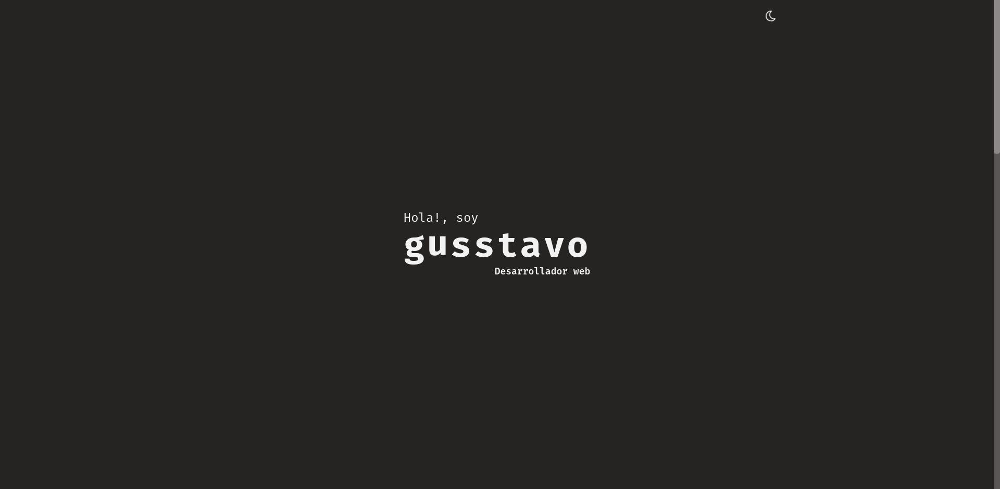

# **Mi portafolio**

Este proyecto se creo usando [Vite](https://vitejs.dev/), con la plantilla de [Vue](https://vuejs.org/).

#### **[+] Preview**
[github-pages](https://guss-renteria.github.io/mi-portafolio/)

#### **[+] Scripts disponibles**
```shell
yarn dev
```

Ejecuta la aplicación en el modo de desarrollo.\
Abra [http://localhost:3000](http://localhost:3000) para verlo en su navegador.

```shell
yarn build
```

Construye la aplicación en la carpeta `dist`.\
Empaqueta correctamente 'Vue' en modo de producción y optimiza la compilación para obtener el mejor rendimiento.

#### **[+] Screenshot**

